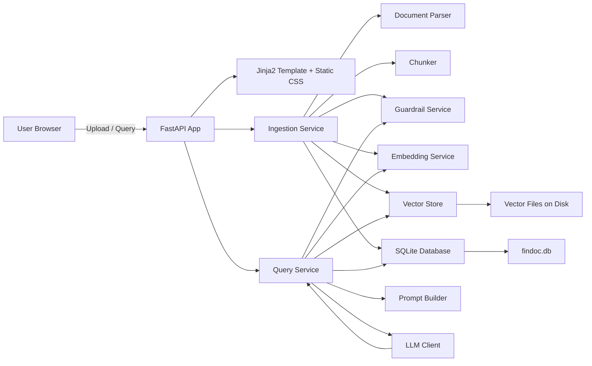
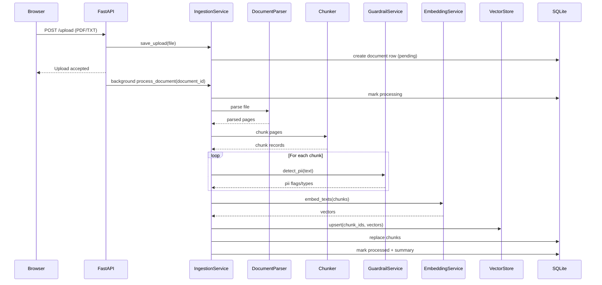
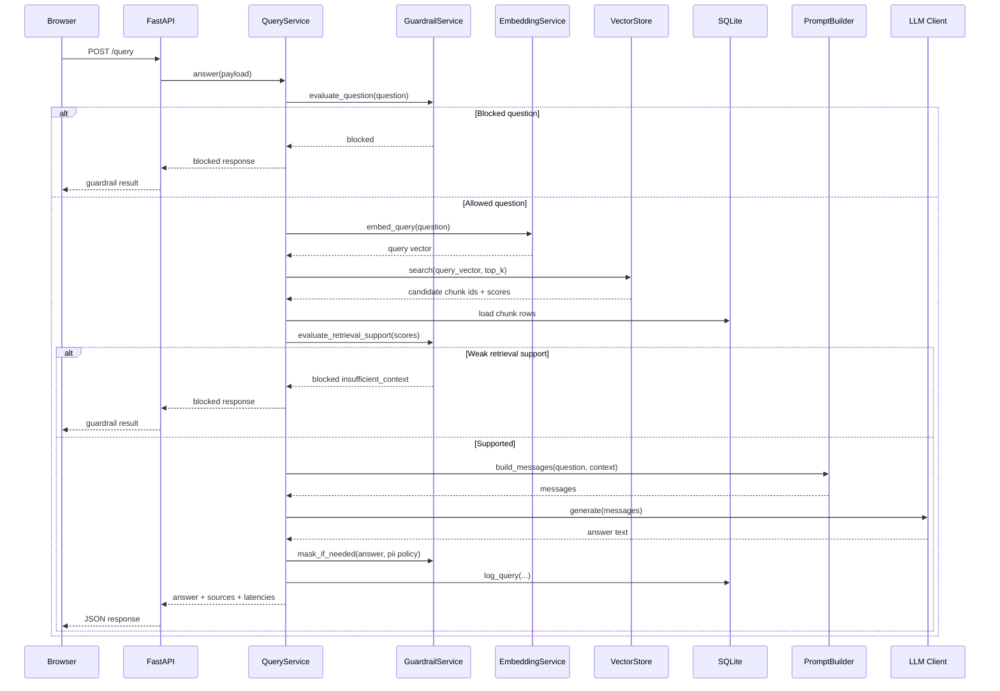

# FinDoc Assist

FinDoc Assist is a FastAPI-based Retrieval-Augmented Generation (RAG) document question-answering application for PDF and text files. It combines document ingestion, chunking, vector retrieval, guardrails, and a simple browser UI so a user can upload documents and ask grounded questions against the indexed content.

The project is intentionally designed to stay runnable in constrained environments:

- If no upstream LLM is configured, it falls back to a deterministic grounded responder.
- If `sentence-transformers` is unavailable, it falls back to a local hashing embedder.
- If `faiss` is unavailable, retrieval still works with NumPy cosine-style similarity over normalized vectors.

This makes the app useful both as a demo/interview project and as a compact reference architecture for safe document QA.

## Table of Contents

- [Core Capabilities](#core-capabilities)
- [System Architecture](#system-architecture)
- [Repository Layout](#repository-layout)
- [End-to-End Flows](#end-to-end-flows)
- [Application Components](#application-components)
- [API Reference](#api-reference)
- [Configuration](#configuration)
- [Data Storage Model](#data-storage-model)
- [Retrieval and Guardrail Behavior](#retrieval-and-guardrail-behavior)
- [Frontend Behavior](#frontend-behavior)
- [Local Development](#local-development)
- [Testing](#testing)
- [Deployment Notes](#deployment-notes)
- [Current Limitations](#current-limitations)
- [Future Improvements](#future-improvements)

## Core Capabilities

- Upload `.pdf` and `.txt` files through the browser UI or HTTP API.
- Extract text from documents and split it into overlapping chunks.
- Generate embeddings using a transformer model when available, or a deterministic hash-based fallback when not.
- Persist document metadata and chunk text in SQLite.
- Persist vector IDs and vector arrays to local disk.
- Retrieve relevant chunks for a question and build a grounded prompt.
- Apply guardrails for prompt injection, sensitive-data extraction attempts, out-of-scope questions, and weak retrieval support.
- Mask or block PII in answers and sources depending on policy.
- Expose a minimal HTML UI plus JSON API endpoints for ingestion, browsing, summarization, and querying.
- Run locally and deploy on Vercel.

## System Architecture



### Runtime Responsibilities

- `FastAPI app`: HTTP routing, HTML rendering, response serialization, error handling, and lifecycle setup.
- `IngestionService`: saves uploads, parses files, chunks content, annotates chunks for PII, embeds chunks, and updates storage state.
- `QueryService`: validates a question, embeds it, retrieves candidate chunks, applies retrieval guardrails, builds prompt context, calls the LLM adapter, and masks output if needed.
- `GuardrailService`: handles question policy checks, support threshold checks, and redaction.
- `EmbeddingService`: provides dense vectors using either a sentence-transformer or deterministic fallback.
- `VectorStore`: stores vectors and supports nearest-neighbor retrieval.
- `Database`: stores document metadata, chunk text, ingestion job history, query logs, and guardrail events.

## Repository Layout

```text
FinDoc_Assist/
|-- api/
|   `-- index.py                # Vercel Python entrypoint
|-- app/
|   |-- config.py              # Settings and runtime paths
|   |-- db.py                  # SQLite schema and persistence helpers
|   |-- dependencies.py        # Cached service factories
|   |-- main.py                # FastAPI routes and UI entrypoint
|   |-- schemas.py             # Pydantic API and domain models
|   |-- services/
|   |   |-- chunking.py        # Chunk generation logic
|   |   |-- embedding.py       # Transformer/hash embeddings
|   |   |-- guardrails.py      # Policy and redaction logic
|   |   |-- ingestion.py       # Upload and indexing pipeline
|   |   |-- llm.py             # Mock/OpenAI-compatible adapters
|   |   |-- parsing.py         # PDF/text parsing
|   |   |-- prompting.py       # Prompt construction
|   |   `-- query.py           # Query and answer flow
|   |-- static/
|   |   `-- styles.css         # Browser UI styling
|   `-- templates/
|       `-- index.html         # Server-rendered UI
|-- tests/
|   |-- test_chunking.py
|   |-- test_guardrails.py
|   `-- test_query_service.py
|-- .env.example
|-- pyproject.toml
|-- requirements.txt
`-- vercel.json
```

## End-to-End Flows

### Upload and Ingestion Flow



### Query and Answer Flow



## Application Components

### 1. FastAPI Surface

Primary application object:

- `app.main:app`

Key behaviors:

- Uses a lifespan hook to ensure upload and vector directories exist.
- Mounts `/static` for CSS assets.
- Renders `/` via Jinja2 templates.
- Converts `HTTPException` instances into structured JSON error payloads.
- Schedules ingestion work via `BackgroundTasks`.

### 2. Service Wiring

Service creation lives in `app/dependencies.py` and uses `functools.lru_cache` so expensive components are reused across requests:

- `VectorStore`
- `EmbeddingService`
- `GuardrailService`
- `LLM client`
- `IngestionService`
- `QueryService`

This keeps the app simple while avoiding repeated initialization on each request.

### 3. Parsing

`DocumentParser` supports:

- `text/plain` and `.txt`: reads the file as UTF-8 with `errors="ignore"`.
- `application/pdf` and `.pdf`: extracts text page-by-page using `pypdf.PdfReader`.

Unsupported file types raise `ValueError`.

### 4. Chunking

`Chunker` creates overlapping chunks to preserve local semantic continuity.

Default behavior:

- Target size: `180` words
- Overlap: `40` words
- Large paragraphs are split into sliding windows.
- Multiple blank lines are normalized.

Chunk IDs follow this pattern:

```text
{document_id}_chunk_{index}
```

### 5. Embeddings

`EmbeddingService` has two modes:

- Preferred mode: `sentence-transformers` using `SentenceTransformer(settings.embedding_model)`
- Fallback mode: token hashing into a normalized dense vector of size `EMBEDDING_DIMENSION`

Fallback behavior matters because it keeps the app operational without downloading a model. Retrieval quality is lower than transformer embeddings, but the system remains demonstrable and testable.

### 6. Vector Store

`VectorStore` persists two files:

- `<VECTOR_INDEX_PATH>.ids.json`
- `<VECTOR_INDEX_PATH>.vectors.npy`

Capabilities:

- `upsert(chunk_ids, vectors)`
- `delete_document_chunks(chunk_ids)`
- `search(query_vector, top_k)`

Search behavior:

- Uses `faiss.IndexFlatIP` if `faiss` is importable.
- Otherwise uses NumPy dot product against stored normalized vectors.

### 7. Database Layer

`Database` wraps SQLite access and initializes schema automatically.

Tables:

- `documents`
- `chunks`
- `ingestion_jobs`
- `query_logs`
- `guardrail_events`

The database stores metadata and chunk text, while the vector store stores numerical embeddings.

### 8. Guardrails

`GuardrailService` covers three stages:

- Question-time blocking
- Retrieval-time support validation
- Output-time redaction or blocking

Question-time protections:

- Prompt injection attempts like "ignore previous instructions"
- Requests for hidden prompts, secrets, API keys, or embeddings
- Sensitive extraction requests like bulk listing or extracting personal data
- Obvious out-of-scope prompts such as weather, news, and stock prices

Retrieval-time protection:

- If no chunk score exceeds `SIMILARITY_THRESHOLD`, the system returns an insufficient-context block instead of hallucinating.

Output-time protection:

- If retrieved chunks contain PII, answers and sources are either allowed, masked, or blocked depending on `PII_MODE`.

Supported PII detectors:

- `email`
- `phone`
- `card_like`
- `account_like`

### 9. LLM Abstraction

`LLMClientFactory` selects between:

- `MockGroundedLLMClient`
- `OpenAICompatibleClient`

`MockGroundedLLMClient`:

- Never calls an external model.
- Produces a deterministic extractive answer from the prompt context.
- Useful for local demos, tests, and offline scenarios.

`OpenAICompatibleClient`:

- Calls `POST {LLM_BASE_URL}/chat/completions`
- Uses `Authorization: Bearer <LLM_API_KEY>` when provided
- Sends `model`, `messages`, `temperature`, and `max_tokens`
- Works with OpenAI-compatible providers such as Groq/OpenRouter-style endpoints

## API Reference

### `GET /health`

Health probe for service readiness.

Example response:

```json
{
  "status": "ok",
  "app": "FinDoc Assist"
}
```

### `GET /`

Renders the HTML UI with:

- upload form
- current document list
- query form
- source snippets

### `POST /upload`

Uploads a `.pdf` or `.txt` document and schedules indexing.

Accepted content:

- `application/pdf`
- `text/plain`
- `.pdf`
- `.txt`

Example response:

```json
{
  "document_id": "doc_123456abcdef",
  "status": "pending",
  "message": "Upload accepted for processing"
}
```

### `GET /documents`

Returns all non-deleted documents in reverse creation order.

Example response:

```json
{
  "documents": [
    {
      "document_id": "doc_123456abcdef",
      "filename": "policy.pdf",
      "status": "processed",
      "chunk_count": 18,
      "pii_detected": true,
      "created_at": "2026-04-10T14:00:00+00:00",
      "updated_at": "2026-04-10T14:01:02+00:00"
    }
  ]
}
```

### `GET /documents/{document_id}`

Returns document metadata plus summary and error fields.

### `GET /documents/{document_id}/summary`

Returns the generated summary for a specific document.

### `DELETE /documents/{document_id}`

Marks the document deleted, removes its chunks from SQLite, deletes associated vectors, and removes the uploaded source file if present.

### `POST /query`

Answers a question using retrieved chunks.

Request shape:

```json
{
  "question": "What does the document say about refund eligibility?",
  "document_ids": ["doc_123456abcdef"],
  "top_k": 10,
  "include_sources": true
}
```

Response shape:

```json
{
  "answer": "Based on the retrieved context: ...",
  "sources": [
    {
      "document_id": "doc_123456abcdef",
      "page_number": 2,
      "chunk_id": "doc_123456abcdef_chunk_4",
      "score": 0.8812,
      "text": "Refunds are available within 30 days ...",
      "contains_pii": false,
      "pii_types": []
    }
  ],
  "guardrail_result": {
    "status": "allowed",
    "category": null,
    "message": null
  },
  "retrieval_latency_ms": 8,
  "generation_latency_ms": 2
}
```

Blocked responses still return a valid response body, but with:

- `answer: null`
- `sources: []`
- `guardrail_result.status: "blocked"`

## Configuration

Environment variables are loaded via `pydantic-settings` from `.env`.

Example values are provided in [.env.example](./.env.example).

| Variable | Purpose | Default |
|---|---|---|
| `APP_NAME` | UI and API application name | `FinDoc Assist` |
| `APP_ENV` | Environment label | `development` |
| `DATABASE_PATH` | SQLite database path | `data/findoc.db` locally, `/tmp/findoc-assist/findoc.db` on Vercel |
| `UPLOAD_DIR` | Uploaded file storage path | `data/uploads` locally, `/tmp/findoc-assist/uploads` on Vercel |
| `VECTOR_INDEX_PATH` | Base path for vector files | `data/vector_index` locally, `/tmp/findoc-assist/vector_index` on Vercel |
| `MAX_UPLOAD_MB` | Max upload size in MB | `10` |
| `EMBEDDING_DIMENSION` | Dense vector size | `384` |
| `EMBEDDING_MODEL` | Sentence-transformer model name | `sentence-transformers/all-MiniLM-L6-v2` |
| `LLM_PROVIDER` | `mock`, `none`, or non-mock provider selector | `mock` |
| `LLM_BASE_URL` | OpenAI-compatible base URL | `https://api.groq.com/openai/v1` |
| `LLM_API_KEY` | API key for upstream provider | empty |
| `LLM_MODEL` | Upstream model name | `llama-3.1-8b-instant` |
| `LLM_TIMEOUT_SECONDS` | HTTP timeout for model calls | `30` |
| `TOP_K` | Initial candidate retrieval count | `10` |
| `FINAL_CONTEXT_K` | Final number of context chunks passed to prompt builder | `5` |
| `SIMILARITY_THRESHOLD` | Minimum support score to answer | `0.25` |
| `PII_MODE` | `allow`, `mask`, or `block` | `mask` |
| `SECRET_KEY` | Reserved secret/config value | `change-me` |

## Data Storage Model

### Filesystem Artifacts

Local development writes runtime artifacts into `data/`:

- `data/findoc.db`
- `data/uploads/*`
- `data/vector_index.ids.json`
- `data/vector_index.vectors.npy`

On Vercel, runtime storage is redirected to `/tmp/findoc-assist` because the deployed filesystem is otherwise read-only.

### SQLite Tables

#### `documents`

Stores one row per uploaded file.

Important fields:

- `id`
- `filename`
- `stored_path`
- `content_type`
- `source_hash`
- `status`
- `chunk_count`
- `pii_detected`
- `summary`
- `error_message`
- timestamps

#### `chunks`

Stores chunk text and metadata.

Important fields:

- `id`
- `document_id`
- `text`
- `page_number`
- `section_title`
- `token_count`
- `contains_pii`
- `pii_types`

#### `ingestion_jobs`

Tracks processing job state and failure information.

#### `query_logs`

Stores question text, target documents, retrieval latency, generation latency, model name, and timestamp.

#### `guardrail_events`

Stores blocked or restricted decisions for observability and auditing.

## Retrieval and Guardrail Behavior

### Retrieval Strategy

1. Embed the question.
2. Search the vector store for `top_k` candidate chunk IDs.
3. Load matching chunk rows from SQLite.
4. Optionally filter to requested `document_ids`.
5. Sort by score and cap final context to `FINAL_CONTEXT_K`.
6. Build prompt messages from the selected context.

### Why Both SQLite and Vector Files Exist

The application splits responsibilities:

- SQLite stores rich metadata and raw chunk text.
- The vector files store dense numerical representations optimized for retrieval.

This keeps the implementation simple and dependency-light while still separating structured storage from retrieval storage.

### Guardrail Outcomes

Possible `guardrail_result.status` values:

- `allowed`
- `blocked`
- `masked`

Examples:

- Prompt injection attempt -> blocked before retrieval
- Sensitive bulk extraction request -> blocked before retrieval
- Low-confidence retrieval -> blocked after retrieval
- Retrieved chunk contains PII with `PII_MODE=mask` -> answer returned with redactions

## Frontend Behavior

The UI is server-rendered with Jinja2 and enhanced with client-side JavaScript.

Features:

- Upload form using `fetch` and `FormData`
- Document refresh via `GET /documents`
- Query submission via `POST /query`
- Dynamic answer and source rendering
- Guardrail banner display for blocked or masked results
- Theme toggle persisted in `localStorage`

The frontend intentionally stays lightweight:

- no build step
- no SPA framework
- no bundler requirement

## Local Development

### Prerequisites

- Python 3.11+
- Recommended: virtual environment

Optional packages for better quality/performance:

- `sentence-transformers`
- `faiss-cpu`

### Install

Using `requirements.txt`:

```bash
python -m venv .venv
.venv\Scripts\activate
pip install -r requirements.txt
```

Using `pyproject.toml`:

```bash
python -m venv .venv
.venv\Scripts\activate
pip install -e .
```

Optional retrieval extras:

```bash
pip install sentence-transformers faiss-cpu
```

### Configure Environment

Create a local `.env` file based on `.env.example`.

Minimal offline/demo setup:

```env
APP_NAME=FinDoc Assist
APP_ENV=development
LLM_PROVIDER=mock
PII_MODE=mask
```

### Run

```bash
uvicorn app.main:app --reload
```

App URLs:

- UI: `http://127.0.0.1:8000`
- Health: `http://127.0.0.1:8000/health`
- Swagger docs: `http://127.0.0.1:8000/docs`

## Testing

Test files:

- [tests/test_chunking.py](./tests/test_chunking.py)
- [tests/test_guardrails.py](./tests/test_guardrails.py)
- [tests/test_query_service.py](./tests/test_query_service.py)

Run:

```bash
python -m pytest -q
```

The current environment used during recent deployment work did not have `pytest` installed in the active interpreter, so command success depends on your local Python environment being set up first.

## Deployment Notes

### Vercel

This project is configured for Vercel via:

- [api/index.py](./api/index.py)
- [vercel.json](./vercel.json)

Key deployment detail:

- On Vercel, runtime write paths automatically switch to `/tmp/findoc-assist`.

That makes the app boot and function, but storage remains ephemeral on serverless infrastructure.

### Current Production URL

- [https://findoc-assist.vercel.app](https://findoc-assist.vercel.app)

### Important Operational Caveat

Uploaded documents, SQLite data, and the vector index are not durable on Vercel between cold starts, instance replacement, or redeployments.

For persistent production storage, move these components to managed services such as:

- Postgres or hosted SQLite-compatible storage for metadata
- object storage for uploaded files
- a managed vector database or durable vector persistence layer

## Current Limitations

- Background ingestion uses FastAPI `BackgroundTasks`, which is convenient but not a durable job queue.
- PDF extraction depends on text being extractable; scanned-image PDFs will not OCR automatically.
- Retrieval quality in fallback embedding mode is lower than transformer-based embeddings.
- The mock LLM client is intentionally extractive and simplistic.
- SQLite plus local vector files are not horizontally scalable.
- Vercel deployment is functional but not yet durable for production document storage.
- Guardrails are regex-based and therefore intentionally simple.

## Future Improvements

- Replace local storage with durable managed services.
- Add OCR for scanned PDFs.
- Introduce hybrid retrieval or reranking.
- Support document reprocessing and chunk versioning.
- Add authentication and user/project isolation.
- Add streaming responses for long answers.
- Add a real background worker queue.
- Add observability dashboards and structured application logs.
- Expand policy controls beyond regex heuristics.

## Summary

FinDoc Assist is a compact but thoughtfully structured RAG application with:

- a clean FastAPI surface
- deterministic fallback behavior
- explicit guardrails
- layered retrieval and storage components
- a lightweight browser interface
- working Vercel deployment support

It is a good baseline for demonstrating safe document QA architecture and a solid starting point for evolving into a more durable production system.
